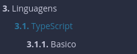

# Programming Manual

Esse é um Manual de Programação, ele contém guias e explicações para programar em certas arquiteturas, linguagens e frameworks, assim como boas práticas e exemplos de código.

Usa-se a crate 'mdbook', usada pelo livro do Rust e diversas outras tecnologias, como documentação. Podemos mudar a paleta de cores, pesquisar, imprimir... O mdbook usa arquivos Markdown (.md), tem hot-reloading durante o desenvolvimento e coloca seus arquivos estáticos no diretório ./book que está dentro do .gitignore para deploy.

Se ainda não tiveres o cargo instalado, podes instalar com [Rustup](https://www.rust-lang.org/pt-BR/tools/install). Já vem o Rust e sua toolchain junto, olha que coisa boa...

Para instalar, buildar e servir facilmente o manual tente digitar:

```bash
make dev
```

Caso nao funcione, tente buildar e rodar o manual de forma manual.

Para instalar a ferramenta que builda o manual, digite:

```bash
cargo install mdbook
```

Caso nao tenhas o cargo no seu path, adicione-o à configuração da sua shell (~/.bashrc ou ~/.zshrc) para não precisar digitar o path toda vez (i.e. ~/.cargo/bin/{program}), rode esse código no terminal:

```bash
#bash
echo 'export PATH="$HOME/.cargo/bin:$PATH"' >> ~/.bashrc
echo 'export PATH="$HOME/.cargo/bin:$PATH"' >> ~/.zshrc
```

Com mdbook instalado entre no projeto e digite:

```bash
mdbook serve
```

Se quiseres escolher o port:

```bash
mdbook serve --port 9999
```

# [Documentação do MdBook](https://rust-lang.github.io/mdBook/index.html)

Você pode criar uma estrutura em src/SUMMARY.rs de capitulos, com titulos e pastas fictícias. O nível de tabs, 'nests' é reproduzido no livro.

```markdown
- [Linguagens](./03_linguagens/00_logica.md)
  - [TypeScript](./03_linguagens/01_typescript/00_introducao.md)
    - [Basico](./03_linguagens/01_typescript/01_basico.md)
```

Esses niveis de 'nesting' criam os arquivos automaticamente, você também pode criar arquivos e referenciar o path deles (mas é mais trabalho). O resultado final é esse:



Assim podemos ter um capitulo de linguagens de programação e subcapitulos sobre cada linguagem e dentro delas subcapitulos sobre conceitos básicos e dentro delas subcapitulos sobre frameworks e dentro delas... Crazy? I was crazy once..
